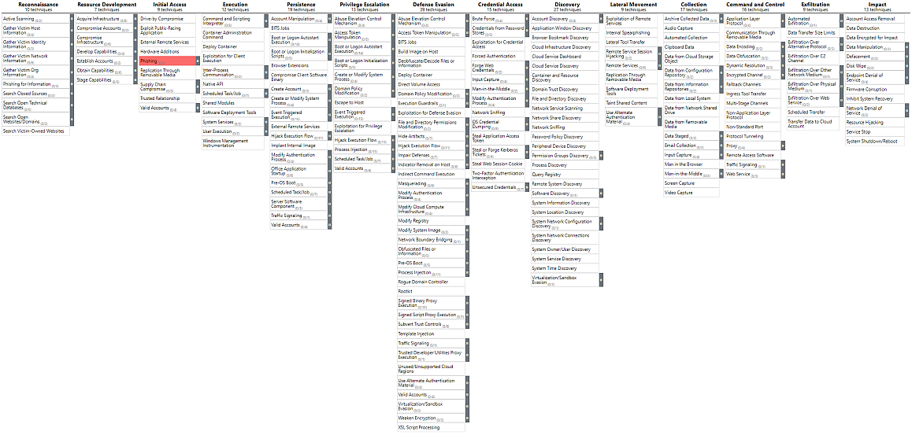

<!-- size:  4:3 -->
<!-- _footer: May,2021 https://github.com/x270/MITRE -->
<!-- _class: invert -->
# MITRE ATT&CK 101
# T1566 Phishing

---
<!-- header: MITRE ATT&CK 101 /  T1566 Phishing -->
<!-- paginate: true -->
<!-- page_number: true -->
### フィッシング超概要
標的にメールを送り付けるソーシャルエンジニアリング。
振り込み詐欺的な被害に直結するものもあれば、  
マルウェア感染のための手段だったりもする。

5W1H|???
---|---
When | 侵入などの前の段階で
Why | マルウェア等のファイルを導入するため
Who | 攻撃者が
Where | 外部から
What | メールやその他の方法で
How |  メッセージを送り付ける

---
<!-- _footer : https://attack.mitre.org/ -->
### MATRICES

---
<!--_footer : https://ja.wikipedia.org/wiki/%E3%83%95%E3%82%A3%E3%83%83%E3%82%B7%E3%83%B3%E3%82%B0_(%E8%A9%90%E6%AC%BA) -->
### フィッシングの語源
`fishing`（釣り）のハッカー的なスラング（Leet的言い換えと呼ばれる意図的な同音別表記）であるが、fがphに変化しているのは`Phreaking`（フリーキング、音声によって電話網を意図的に誤作動させる不正行為）からの類推であると欧米では考えられている。しかし、日本国内のメディアでは`sophisticated`（洗練された）との合成語であるとする見解が主流である。このほか、`password harvesting fishing` の略とする説もある。

---
<!--_footer : https://www.intellilink.co.jp/column/security/2020/061700.aspx -->
### MITRE ATT&CK上の定義（前半）
> 攻撃者はフィッシングメッセージを送信して機密情報を引き出したり、被害者のシステムにアクセスしたりする可能性があります。 すべての形式のフィッシング攻撃は、電子的に配信されるソーシャルエンジニアリングです。 スピアフィッシングとして知られているフィッシング攻撃は標的を定めることができます。 スピアフィッシングでは、特定の個人、企業、または業界が攻撃者の標的になります。 より一般的には、攻撃者は、大量のマルウェアスパムキャンペーンなどで、標的を限定しないフィッシング攻撃を実行できます。

---
<!--_footer : https://www.intellilink.co.jp/column/security/2020/061700.aspx -->
### MITRE ATT&CK上の定義（後半）
> 攻撃者は悪意のある添付ファイルまたはリンクを含む被害者の電子メールを送信し、通常、被害者のシステムで悪意のあるコードを実行したり、有効なアカウントを使用するための認証情報を収集したりします。 フィッシングは、ソーシャルメディアプラットフォームなどのサードパーティのサービスを介して行われる場合もあります。

---
<!--_footer : https://attack.mitre.org/techniques/T1566/ -->
### 分類

項目 | 説明
--- | ---
ID | T1566
サブテクニック | T1566.001, T1566.002, T1566.003
戦術 | 初期アクセス
プラットフォーム | Google Workspace, Linux, Office 365, SaaS, Windows, macOS
データソース | アプリケーションログ ・アプリケーションログコンテンツ ネットワークトラフィック ・ネットワークトラフィックコンテンツ ・ネットワークトラフィックフロー

---
<!--_footer : https://attack.mitre.org/techniques/T1566/ -->
### 3つのサブテクニック
- T1566.001 SpearPhishing Attachment
添付ファイルによるスピアフィッシング
- T1566.002 SpearPhishing Link
リンクによるスピアフィッシング
- T1566.003 SpearPhishing via Service
サービスを利用したスピアフィッシング

---
### 補足）もともとは別のIDが振られていた
- T1192 SpearPhishing Link
- T1193 SpearPhishing Attachment
- T1194 SpearPhishing via Service

これら3つが、T1566のサブテクニックに再分類された。

---
<!--_footer : https://attack.mitre.org/techniques/T1566/001/ -->
### T1566.001 SpearPhishing Attachment
- メールでファイルを送付し、ユーザの実行を期待。
ファイルを開く必要があることをメール本文で説明。
システム保護の回避方法を説明している場合もある。

- MS Office、実行可能ファイル、PDFなどが用いられる。

- 防御機構を回避するため、パスワード付き圧縮ファイルを用いたり、別の形式に見せかけるために拡張子やアイコンの偽装も行われる。

---
<!--_footer : https://attack.mitre.org/techniques/T1566/002/ -->
### T1566.002 SpearPhishing Link
- メール本文にリンクを載せ、ユーザのアクセスを期待。
リンクを踏む必要があることをメール本文で説明。
- 添付ファイルはメールサービスのチェック機構で防御される可能性があるが、それの回避が期待できる。

- メール受信したことを確認するためのWebビーコンが埋め込まれる場合もある。

---
<!--_footer : https://attack.mitre.org/techniques/T1566/003/ -->
### T1566.003 Spearphishing via Service
- メールではなく、サードパーティのサービスを利用。
SMS、個人のWebメール、その他企業が管理していないサービスを介してメッセージを送信。これらは企業のメールに比べてセキュリティポリシーが厳しくない。

- 一般的な例は、ソーシャルメディアを介してターゲットと信頼関係を構築し、ターゲットが業務用PCで使用する個人のWebメールにコンテンツを送信する方法。&#x1f914;&#x2753;

---
<!-- _class: invert -->
# スピアフィッシングの小ネタ

不審なメールかどうかぐらい見分けられるっしょ！

---
### 日本航空のビジネスメール詐欺事件

取引先を装った振込口座変更メールにより3.8億円の被害。  
うっかり添付ファイルを開いてしまった等ではなく、  
（理由はあれど）メールの内容を信用したからこその事件。
本気で狙われれば大きな被害に繋がる。
[日本航空が被害を受けたビジネスメール詐欺をまとめてみた \- piyolog](https://piyolog.hatenadiary.jp/entry/20171220/1513795615)

---
<!-- _class: invert -->
# 添付ファイル関連の小ネタ

怪しいファイルかどうかぐらい見分けられるっしょ！

---
### アイコンの偽装
- 実行ファイルのビルド時にアイコンは自由に設定可能。
既存ファイルのアイコン変更ツールも無数に存在する。

- 普段から見慣れたtxtやxlsx、pdfの標準アイコンなら
実行ファイルに見えない。

---
### 拡張子の偽装
アラビア語など、右から左へ読む言語のための制御コード
Right-to-Left Override（RLO）の利用。
文字コードは`U+202E`で、以降の表記順が左右反転する。

Phishing.exe
↓
Phishingfdp.exe
↓
Phishing`U+202E`fdp.exe
↓
Phishingexe.pdf

---
### 自己解凍型exeファイルの害悪
「安全にファイルをやり取りするため」のソリューションでexe形式を採用している例もある。
> メール送信のルールで拡張子exeの送付ができません。
お手数ですが、ex_をexeに変更して実行してください。

なんてのも通用する世の中。  

exeファイルを開くことに抵抗がない会社、従業員もいる。

[日立ソリューションズ『秘文 File Encryption』と自己解凍型exeファイルに対する反応 \- Togetter](https://togetter.com/li/831672)

---
<!-- _class: invert -->
# リンク（≒URL）の小ネタ

怪しいURLかどうかぐらい見分けられるっしょ！

---
<!-- _footer : https://eset-info.canon-its.jp/malware_info/special/detail/151001.html -->
### ホモグラフ攻撃
似た文字を使用することで正しいURLのように見せる。
- apple - 4文字目が小文字のエル
- appIe - 4文字目が大文字のアイ
- microsoft - m
- rnicrosoft - rとn

---
<!-- _footer : https://eset-info.canon-its.jp/malware_info/special/detail/151001.html -->
### IDNホモグラフ攻撃
国際化ドメイン名(IDN)の開始により、ASCII文字以外も使用できるようになり、無数にパターンを作れてしまう。

- а - キリル文字のa
- œ - フランス語で使うOとEの合字
- ij - オランダ語で使う二重音字

[IDNホモグラフ攻撃の大規模実態調査：傾向と対策 - 情報学広場：情報処理学会電子図書館](https://ipsj.ixsq.nii.ac.jp/ej/index.php?active_action=repository_view_main_item_detail&page_id=13&block_id=8&item_id=192130&item_no=1)

UnicodeConsortiumが公開している外形が近い文字リスト。
[confusables\.txt- www\.unicode\.org](http://www.unicode.org/Public/security/8.0.0/confusables.txt)

---

### Typosquattingドメイン

URLの入力ミスを狙って、ドメインの一部の文字をキーボード配列で隣接する文字に入れ替えたドメイン名。  
SpearPhishing Linkなどは入力させるわけではないので、  
本スライドとの関連は薄いと思われる。

### Combosquattingドメイン
正規サービス名の後ろに単語を付け加えたドメインのこと。
仰々しい名称はついているが、正規サイトに見せかける常套手段として以前から存在しているものと思われる。
[CiNii 論文 \-  Combosquattingドメインネームの生成モデルとその評価](https://ci.nii.ac.jp/naid/170000178541/)

---
### 短縮URL
SNSをはじめ、短縮URLの利用が当たり前に。  
わざわざ似たドメインを取らずとも、リンク先を隠せる。  
長いURLを送れないSMSとの相性もよいと思われる。  
[【セキュリティ ニュース】フィッシング報告、URLともに3カ月連続で増加 \- 偽Appleは短縮URLを愛用：Security NEXT](https://www.security-next.com/084475)

---
<!-- _class: invert -->
# フィッシングサイトの小ネタ

怪しいサイトかどうかぐらい見分けられるっしょ！

---
### Webクローニングツール
SET（Social Engineering Toolkit）やHTTrackなどの  
Webクローニングツールが出回っている。
Kali Linuxにも標準で導入されている。
[trustedsec/social\-engineer\-toolkit: The Social\-Engineer Toolkit \(SET\) ](https://github.com/trustedsec/social-engineer-toolkit)  
[HTTrack Website Copier \- Free Software Offline Browser \(GNU GPL\)](https://www.httrack.com/)

HTTrackを使用したサイトの観測例。
[国内金融機関利用者を狙うフィッシング詐欺をJC3と共同調査 \| トレンドマイクロ セキュリティブログ](https://blog.trendmicro.co.jp/archives/27635)

---
### ブラウザ拡張機能によるWebクローニング
Chrome、Firefox向けの拡張機能「SingleFile」を利用した  
フィッシング攻撃の観測例がある。
[正規ブラウザ拡張機能を利用するフィッシング攻撃を確認 \| トレンドマイクロ セキュリティブログ](https://blog.trendmicro.co.jp/archives/21077)

- 閲覧中のWebページを1つのHTMLファイルに保存。
- 画像はSVGに変換され、HTML中に直接記述される。

---
<!-- _class: invert -->
# 実例
ファイル経由でのマルウェア感染のパターンと、  
メールとWebサイトだけで完結したパターンの2つを挙げる

---
<!-- _footer : https://gblogs.cisco.com/jp/2020/05/talos-poetrat-covid-19-lures/ -->
### PoetRAT
- 標的：アゼルバイジャンの政府機関やエネルギー業界
- Python製のリモートアクセス型トロイの木馬(RAT)

ユーザがdocファイルを開く
→VBSが起動 
→ファイル自身の末尾の数バイトを切り出し、zipで保存　
→VBSでzipを展開
→中身のPythonスクリプトを起動
→環境チェック後にメインスクリプトを実行

---
<!-- _footer : https://www.trendmicro.com/en_us/research/17/d/pawn-storm-abuses-open-authentication-advanced-social-engineering-attacks.html -->
### PawnStorm
- 標的：ドイツのキリスト教民主連合、トルコ議会など
- GoogleアカウントのOAuthトークンを取得する攻撃

Googleアカウントとの連携を要求するメールを送る。
連携アプリ名はそれっぽい「Google Defender」と表示。
→メール内のボタン（リンク）をユーザがクリック
→本物のGoogleのサイト(account.google.com)が開く
→アカウント連携の確認を求められ、ユーザが同意
→GoogleからOAuthトークンが発行される

利用者が気づいて連携を解除しない限り、  
攻撃者は半永久的にGmailやGoogle Driveにアクセス可能。  
Yahooのアカウント連携に対しても実行されている。

---
<!-- _class : invert -->
### 参考
- [Phishing, Technique T1566 \- Enterprise \| MITRE ATT&CK®](https://attack.mitre.org/techniques/T1566/)
- [MITRE ATT&CK® 頻出手口 トップ10（2020年度下期）: NECセキュリティブログ | NEC](https://jpn.nec.com/cybersecurity/blog/210402/index.html)
- [MITRE ATTA&CK の日本語化プロジェクト \- attack\-mitre\-japan](https://www.attack-mitre-japan.com/)
- [atomic\-red\-team/T1566\.001\.md at master · redcanaryco/atomic\-red\-team](https://github.com/redcanaryco/atomic-red-team/blob/master/atomics/T1566.001/T1566.001.md)
- [MITRE ATT&CK その2 ～攻撃手法と緩和策（フィッシング攻撃の場合）～ \| NTTデータ先端技術株式会社](https://www.intellilink.co.jp/column/security/2020/061700.aspx)
- [ボットネット「Trickbot」を途絶えさせるための世界規模の取り組みにESET社も参加 \| サイバーセキュリティ情報局](https://eset-info.canon-its.jp/malware_info/trend/detail/201111.html)
- [Sophisticated Microsoft Spoof Targets Financial Departments \| Area 1 Security](https://www.area1security.com/blog/microsoft-365-spoof-targets-financial-departments/)