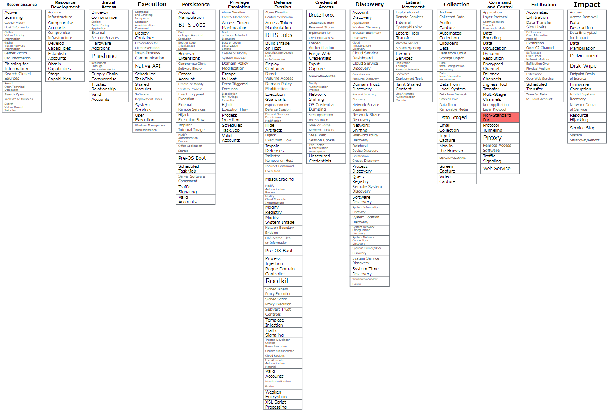
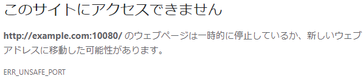

<!-- size:  4:3 -->
<!-- _footer: June,2021 https://github.com/x270/MITRE -->
<!-- _class: invert -->
# MITRE ATT&CK 101
# T1571 Non-Standard Port

---
<!--_footer : https://attack.mitre.org/techniques/T1571/ -->
### MITRE ATT&CK上の定義（原文）
> Adversaries may communicate using a protocol and port paring that are typically not associated. For example, HTTPS over port 8088 or port 587 as opposed to the traditional port 443. Adversaries may make changes to the standard port used by a protocol to bypass filtering or muddle analysis/parsing of network data.

---
<!--_footer : https://attack.mitre.org/techniques/T1571/ -->
### MITRE ATT&CK上の定義

> 攻撃者は、通常は関連付けられていないプロトコルとポートを組み合わせて通信する場合がある。例として、HTTPSの通信で標準の443ではなく、8088や587を使用する。これは、フィルタリングを回避したり、ネットワーク情報の分析/解析を妨げるためである。


---
<!--_footer : https://attack.mitre.org/techniques/T1571/ -->
### 分類

項目 | 説明
--- | ---
ID | T1571
サブテクニック | なし
戦術 | コマンドアンドコントロール
プラットフォーム | Linux, Windows, macOS
データソース | ネットワークトラフィック<br>・ネットワーク接続の作成<br>・ネットワークトラフィックコンテンツ<br>・ネットワークトラフィックフロー

---
<!-- _footer : https://attack.mitre.org/ -->
### MATRICES


---
<!--_footer : https://attack.mitre.org/techniques/T1571/ -->
### 緩和策の観点から

#### M1031 Network Intrusion Prevention
シグネチャを使用し、特定の攻撃者・マルウェアのトラフィックを識別し、侵入検知/防止する。

#### M1030 Network Segmentation
ファイアウォールとプロキシを適切に構成し、そのセグメントに必要なポートのみにトラフィックを制限する。


---
<!--_footer : https://attack.mitre.org/techniques/T1571/ -->
### 検出の観点から

> パケットの内容を分析し、使用されているポートから予想されるプロトコルの動作に従わない通信を検出します。

> 珍しいデータフロー（通常よりもはるかに多くのデータを送信するなど）について分析します。通常はネットワーク通信がないプロセスや、見たことのないネットワークを使用するプロセスは疑わしい。

---
<!--_footer : https://redcanary.com/threat-detection-report/threats/trickbot/ -->
### 検出の実例）TrickBot

> TrickBotがインストールされた直後に、TCPポート443, 447, 449を使用してHTTP経由でアウトバウンドNW接続を確率することに気づいた。また、これらの接続はsvchost.exeから発生していた。

> 多くの環境でsvchostがポート447, 449を介して外部接続することは異常であると判断し、検出分析を作成した。

---
<!--_footer : https://media.paloaltonetworks.com/documents/The-Modern-Malware-Review-March-2013.pdf -->
### 非標準ポートの利用率
たいへん古いが、2013年のPaloaltoのレポートより。

> マルウェアによるFTPセッションの97%が非標準ポートを経由している。

> カスタムTCPでは、43%が既知のポートと関連付けられていない非標準ポートを利用。

---
<!--_footer : https://sonicwall-pub.snwl.jp/files/newsmedia/NEWSRELEASE_SonicWall_ThreatReport-SNWL0819.pdf -->
### 非標準ポートの利用率
2020年のSonicWallのレポートより。

> 2020年のこれまでのところ、平均23%の攻撃が非標準ポートを経由。これは同社が2018年に攻撃元区分の追跡を開始して以来最高。

---
<!--_footer : https://chromium.googlesource.com/chromium/src/+/refs/heads/main/net/base/port_util.cc -->
### Chromeなどが許可していないポート

```c
// The general list of blocked ports. Will be blocked unless a specific
// protocol overrides it. (Ex: ftp can use port 21)
// When adding a port to the list, consider also adding it to kAllowablePorts,
// below.
const int kRestrictedPorts[] = {
    1,      // tcpmux
    7,      // echo
    9,      // discard
    ：
    427,    // SLP (Also used by Apple Filing Protocol)
    ：
    10080,  // Amanda
};
```


---

<!--_footer :  https://www.iana.org/assignments/service-names-port-numbers/service-names-port-numbers.xhtml -->
### Service Name and Transport Protocol Port Number Registry
サービス名とポート番号の対応を、IANAが「Service Name and Transport Protocol Port Number Registry」で公開している。


---
<!-- _class : invert -->
### 参考
- [AsyncOS 11\.5\.1 for Cisco Web Security Appliances ユーザ ガイド（一般導入） \- 非標準ポートでの不正トラフィックの検出 \[Cisco Web セキュリティ アプライアンス\] \- Cisco](https://www.cisco.com/c/ja_jp/td/docs/security/wsa/wsa11-5/user_guide/b_WSA_UserGuide_11_5_1/b_WSA_UserGuide_11_5_1_chapter_010100.html)

